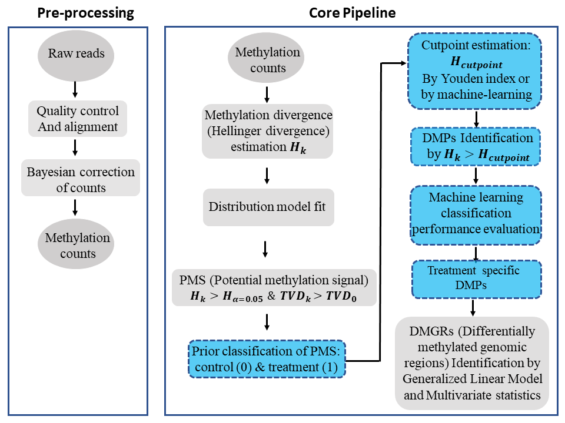

<!-- README.md is generated from README.Rmd. Please edit that file -->
Methyl-IT 
==========================================================

 

Overview
--------

We have developed a novel methylome analysis procedure, Methyl-IT, based on
signal detection and machine learning. Methylation analysis is confronted in
Methyl-IT as a signal detection problem, and the method was designed to
discriminate methylation regulatory signal from background noise induced by
Brownian motion and thermal fluctuations. Our group has proposed an information
thermodynamics approach to investigate genome-wide methylation patterning based
on the statistical mechanical effect of methylation on DNA molecules
([1](#1)-[3](#3)). The information thermodynamics-based approach is postulated
to provide greater sensitivity for resolving true signal from the thermodynamic
background within the methylome ([1](#1)). This theory provides the knowledge
on the family of probability distributions that better fit the methylation
signals when expressed in terms of information divergences of methylation
levels. Because the biological signal created within the dynamic methylome
environment characteristic of organisms is not free from background noise, the
approach, designated Methyl-IT, includes an application of signal detection
theory.

It is important to highlight that, to date, MethylIT approach is the only one
methylation analysis approach sets on well established and rigorous statistical
physics (and thermodynamics) ground. The study ([1](#1)) implies that
traditional statistical (*ad hoc*) approaches must not be applied to the
analysis of methylation process, since these statistical approaches ignores the
continuous action of the Second Law of Thermodynamics on living organisms, and
their assumptions are not valid in the thermal bath of the cells.

A basic requirement for the application of signal detection is the knowledge of
the background noise probability distribution. A generalized gamma (GG)
probability distribution model can be deduced on a statistical
mechanical/thermodynamics basis for DNA methylation induced by thermal
fluctuations ([1](#1)), which leads to the particular cases of members of GG
probability distribution family. For example, assuming that this background
methylation variation is consistent with a Poisson process, it can be
distinguished from variation associated with methylation regulatory machinery,
which is non-independent for all genomic regions ([1](#1)). An
information-theoretic divergence to express the variation in methylation
induced by background thermal fluctuations will follow a probability
distribution model, member of the GG family, provided that it is proportional
to minimum energy dissipated per bit of information from methylation change.
The information thermodynamics model was previously verified with more than 150
Arabidopsis and more than 90 human methylome datasets ([3](#3)).

With Methyl-IT R package we are providing the functions from the R scripts used
in the manuscript ([1](#1)), as well as, additional functions that will be used
in further studies. The application of the information thermodynamics of
cytosine DNA methylation is not limited to the current methylome analysis,
which is only a particular application. The theory permits us the study of
plant and animal methylomes in the framework of a communication system
([3](#3)), where cytosine DNA methylation has the dual roles of stabilizing the
DNA molecule and to carry the regulatory signals.

The application of Methyl-T signal detection-machine learning approach to
methylation analysis of whole genome bisulfite sequencing (WGBS) data permits
a high level of methylation signal resolution in cancer-associated genes and
pathways ([4](#4)), as well as, treatment-associated genes and pathways in 
plants ([5](#5)).

Notice that MethylIT pipeline is not limited to bisulfite sequencing
experimental data. Any experimental data set on summarized 
[GRanges-class](https://rdrr.io/bioc/GenomicRanges/man/GRanges-class.html) or
[GRangesList-class](https://rdrr.io/bioc/GenomicRanges/man/GRangesList-class.html)
objects carrying the counts of methylated (mC) and unmethylated (uC) cytosines
in their metacolumns can be analyzed. As a matter of fact, since cell's
developmental stages in a tissue are not synchronized, but in different
ontogenetic development stages, the methylation status at each cytosine site
would dynamically vary from cell to cell. Therefore, at tissue level, the
methylation status can be quantitaivally represented by a probability, i.e., a
number between 0 and 1, also known as methylation level.

Status
------
Currently, the package is actively used in methylation analyses. 

Flow diagram
------------

Download
--------

The available open source version is only for non-commercial use. The software 
shall be used for non-commercial purposes including teaching, academic and 
government research, public demonstrations, personal experimentation, and/or the 
evaluation of the Software, other than in a live operating environment, to determine
whether to enter into a commercial license. THE PACKAGE IS PROVIDED "AS IS", WITHOUT 
WARRANTY OF ANY KIND, EXPRESS OR IMPLIED (see LICENSE file).

[Methyl-IT](https://methylit.com) can be downloaded at:
https://methylit.com

Get Started
-----------
[Fast starting here](https://genomaths.github.io/methylit/articles/MethylIT.html)

Tutorials
--------
* [Get started-with Methyl-IT](https://genomaths.github.io/methylit/articles/MethylIT.html)
* [Methylation analysis with Methyl-IT](https://genomaths.github.io/methylit/articles/Methylation_analysis_with_Methyl-IT.html)
* [Example of Methylome Analysis with MethylIT using Cancer Datasets](https://genomaths.github.io/methylit/articles/cancer_example.html)
* [Optimal cutpoint for the methylation signal](https://genomaths.github.io/methylit/articles/Cutpoint_estimation_with_Methyl-IT.html)
* [Principal Components and Linear Discriminant Analyses with Methyl-IT](https://genomaths.github.io/methylit/articles/pca_lda_with_methylit.html)
* [Association Between Gene Expression and Cytosine DNA Methylation at gene-body](https://genomaths.github.io/methylit/articles/GenExp_Methylation_association_hyper_down-regulated.html)
* [DMR detection with Methyl-IT](https://genomaths.github.io/methylit/articles/dmr_at_memory.html)
--------

Methyl-IT documentation:
------------

Whole documentation, manual and several examples, are available at <a href="https://genomaths.github.io/methylit/" target="_blank">Methyl-IT website</a>

--------

Scripts and additional examples at:
---------

https://git.psu.edu/genomath/MethylIT_examples

[R script and data for testing after installation](https://drive.google.com/open?id=12D0vasaptB2IpA_HFxe6lzP5kxNEJqPF)

---------

Report issues (bugs):
---------
[Here](https://github.com/genomaths/MethylIT/issues)

------------

References
----------

<a name="1">1</a>. Sanchez R, Mackenzie SA. On the thermodynamics of DNA methylation process. Sci Rep. 2023;13: 8914. doi:10.1038/s41598-023-35166-9.

<a name="2">2</a>. Sanchez, R.; Yang, X.; Maher, T.; Mackenzie, S.A. Discrimination of DNA Methylation Signal from Background Variation for Clinical Diagnostics. [Int. J. Mol. Sci. 2019, 20, 5343](https://doi.org/10.3390/ijms20215343). 

  <a name="3">3</a>. Sanchez R, Mackenzie SA: Genome-Wide Discriminatory Information Patterns of Cytosine DNA Methylation. [Int. J. Mol. Sci. 2016, 17(6), 938](https://dx.doi.org/10.3390%2Fijms17060938). 

 <a name="4">4</a>. Sanchez R, Mackenzie SA: Information Thermodynamics of Cytosine DNA Methylation. [Plos One 2016, 11](https://doi.org/10.1371/journal.pone.0150427). 

 <a name="5">5</a>. Sanchez R, Mackenzie SA: Integrative Network Analysis of Differentially Methylated and Expressed Genes for Biomarker Identification in Leukemia. [Sci Rep 2020, 10(1), 2123](https://doi.org/10.1038/s41598-020-58123-2). 

 <a name="6">6</a>. Yang, X, Sanchez, R et al.: Segregation of an MSH1 RNAi transgene produces heritable non-genetic memory in association with methylome reprogramming. [Nature Communications 2020, 11(1), 2214](https://doi.org/10.1038/s41467-020-16036-8). 

License
-------

You are free to copy, distribute and transmit MethylIT for non-commercial purposes. Any use of MethylIT for a commercial purpose is subject to and requires a special license.

Contact
-------

For questions about the MethylIT project, see [contact](https://methylit.com) at: https://methylit.com

Contributor Code of Conduct
---------------------------

Please note that this project is released with a [Contributor Code of Conduct](CONDUCT.md). By participating in this project you agree to abide by its terms.
