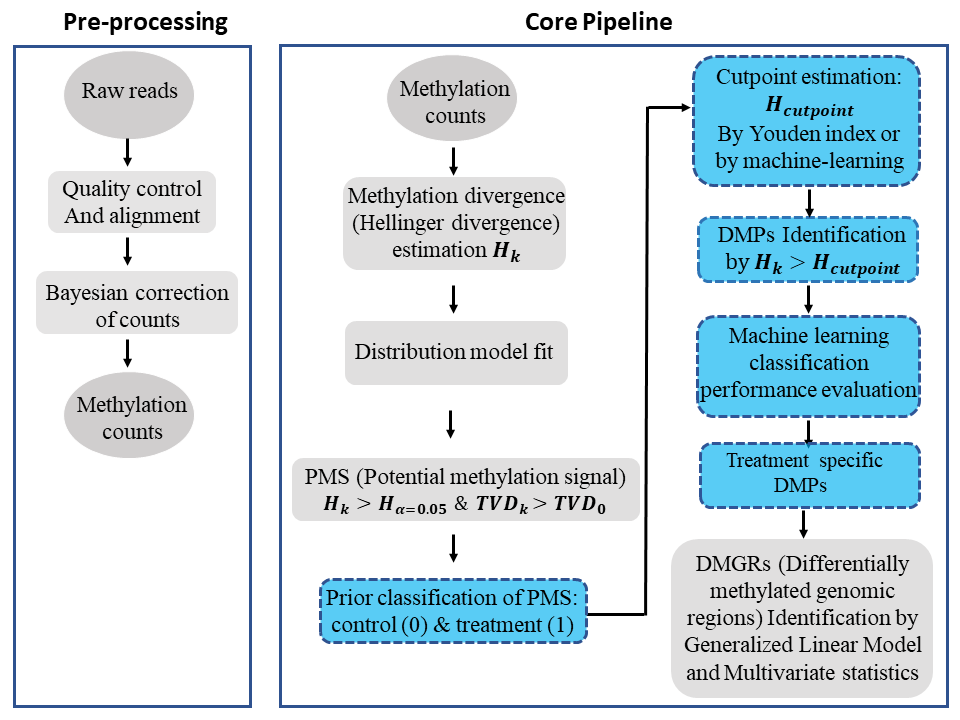

<!-- README.md is generated from README.Rmd. Please edit that file -->
Methyl-IT 
==========================================================

 

Overview
--------

We have developed a novel methylome analysis procedure, Methyl-IT, based on
signal detection and machine learning. Methylation analysis is confronted in
Methyl-IT as a signal detection problem, and the method was designed to
discriminate methylation regulatory signal from background noise induced by
Brownian motion and thermal fluctuations. Our group has
proposed an information thermodynamics approach to investigate genome-wide
methylation patterning based on the statistical mechanical effect of methylation
on DNA molecules ([1](#1)-[3](#3)). The information thermodynamics-based
approach is postulated to
provide greater sensitivity for resolving true signal from the thermodynamic
background within the methylome ([1](#1)). This theory provides the knowledge
on the family of probability distributions that better fit the methylation
signals when expressed in terms of information divergences of methylation
levels. Because the biological signal created within the dynamic methylome
environment characteristic of organisms is not free from background noise, the
approach, designated Methyl-IT, includes an application of signal detection
theory.

A basic requirement for the application of signal detection is the knowledge of
the background noise probability distribution. A generalized gamma (GG)
probability distribution model can be deduced on a statistical
mechanical/thermodynamics basis for DNA methylation induced by thermal
fluctuations ([1](#1)), which leads to the particular cases of members of GG
probability distribution family. For example, assuming that this background
methylation variation is consistent with a Poisson process, it can be
distinguished from variation associated with methylation regulatory machinery,
which is non-independent for all genomic regions ([1](#1)). An
information-theoretic divergence to express the variation in methylation induced
by background thermal fluctuations will follow a probability distribution model,
member of the GG family, provided that it is proportional to minimum energy
dissipated per bit of information from methylation change. The information
thermodynamics model was previously verified with more than 150 Arabidopsis and
more than 90 human methylome datasets ([3](#3)).

With Methyl-IT R package we are providing the functions from the R scripts used
in the manuscript ([1](#1)), as well as, additional functions that will be used
in further studies. The application of the information thermodynamics of
cytosine DNA methylation is not limited to the current methylome analysis, which
is only a particular application. The theory permits us the study of plant and
animal methylomes in the framework of a communication system ([3](#3)), where
cytosine DNA methylation has the dual roles of stabilizing the DNA molecule and
to carry the regulatory signals.

The application of Methyl-T signal detection-machine learning approach to
methylation analysis of whole genome bisulfite sequencing (WGBS) data permits
a high level of methylation signal resolution in cancer-associated genes and
pathways ([4](#4)).

Status
------
Currently, the package is actively used in methylation analyses. Nevertheless,
improvements are regularly introduced. Watch this repo or check for updates. THE
PACKAGE IS PROVIDED "AS IS", WITHOUT WARRANTY OF ANY KIND, EXPRESS OR IMPLIED.

Installation
------------

Be sure that both the R and bioconductor packages are up to date. To get the
latest version of Bioconductor by starting R and entering the commands:
    
    if (!requireNamespace("BiocManager")) install.packages("BiocManager")
    BiocManager::install()

Install OS packages:

CentOS 7

    sudo yum -y install libcurl-devel.x86_64 openssl-devel.x86_64 libxml2-devel mariadb-devel.x86_64

Ubuntu

    sudo apt install libmysqlclient-dev libcurl4-openssl-dev libssl-dev libxml2-dev git build-essential

Install R dependencies:
    
    install.packages(c("ArgumentCheck", "caret", "Epi", "e1071", "minpack.lm", "nls2", "caTools", "rmarkdown",   "RCurl"),dependencies=TRUE)
    
    BiocManager::install(c('BiocParallel', 'biovizBase', 'genefilter', 'GenomeInfoDb', 'GenomicRanges'))

You can install MethylIT from GitHub or PSU's GitLab:

    install.packages("devtools")
    # Master stable version (0.3.2)
    devtools::install_git("https://github.com/genomaths/MethylIT.git")
    
    # Beta (developing) version (0.3.2_beta):
    devtools::install_git("https://github.com/genomaths/MethylIT.git", ref = "MethylIT_0.3.2_beta") 
       

Flow diagram
------------

Get Started
-----------
[Fast starting here](https://genomaths.github.io/methylit/articles/MethylIT.html)

Some simple examples
--------

[An example with simulated datasets](https://genomaths.github.io/methylit/articles/Methylation_analysis_with_Methyl-IT.html) to illustrate why a signal detection step is needed in methylation analysis.   

[Optimal cutpoint for the methylation signal](https://genomaths.github.io/methylit/articles/Cutpoint_estimation_with_Methyl-IT.html).

[Principal Components and Linear Discriminant Analyses with Methyl-IT](https://genomaths.github.io/pca_lda_with_methylit.html)

--------

MethylIT documentation:
------------

Whole documentation, manual and several examples, are available at <a href="https://genomaths.github.io/methylit/" target="_blank">Methyl-IT website</a>

--------

Scripts and additional examples at:
---------

https://git.psu.edu/genomath/MethylIT_examples

[R script and data for testing after installation](https://drive.google.com/open?id=12D0vasaptB2IpA_HFxe6lzP5kxNEJqPF)

---------

Report issues (bugs):
---------
[Here](https://github.com/genomaths/MethylIT/issues)

------------

References
----------

<a name="1">1</a>. Sanchez, R.; Yang, X.; Maher, T.; Mackenzie, S.A. Discrimination of DNA Methylation Signal from Background Variation for Clinical Diagnostics. [Int. J. Mol. Sci. 2019, 20, 5343](https://doi.org/10.3390/ijms20215343). 

  <a name="2">2</a>. Sanchez R, Mackenzie SA: Genome-Wide Discriminatory Information Patterns of Cytosine DNA Methylation. [Int. J. Mol. Sci. 2016, 17(6), 938](https://dx.doi.org/10.3390%2Fijms17060938). 

 <a name="3">3</a>. Sanchez R, Mackenzie SA: Information Thermodynamics of Cytosine DNA Methylation. [Plos One 2016, 11](https://doi.org/10.1371/journal.pone.0150427). 

 <a name="4">4</a>. Sanchez R, Mackenzie SA: Integrative Network Analysis of Differentially Methylated and Expressed Genes for Biomarker Identification in Leukemia. [Sci Rep 2020, 10(1), 2123](https://doi.org/10.1038/s41598-020-58123-2). 

License
-------

You are free to copy, distribute and transmit MethylIT for non-commercial purposes. Any use of MethylIT for a commercial purpose is subject to and requires a special license.

Contact
-------

For questions about the MethylIT project, contact <rus547@psu.edu>

Contributor Code of Conduct
---------------------------

Please note that this project is released with a [Contributor Code of Conduct](CONDUCT.md). By participating in this project you agree to abide by its terms.
